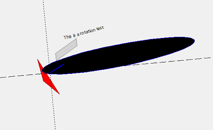

# TransformCanvas
A tk.Canvas derived class that allows to transform the entire scene using local and global translation, scaling and rotation.
Since tkinter is Python's standard drawing library and already has many abilities, this extension might help to achieve more without the necessity of any fancy additional library.
This class gets used by the TransformCanvasTest class.

## Install
### Create a conda environment
```bash
conda init bash # => Open new terminal
conda create --name transform_canvas python=3.8  # Uses the np.ndarray @ operator (since 3.5)
conda install --name transform_canvas numpy
conda install --name transform_canvas tk
```

### Activate the conda environment and start the program
```bash
cd transform_canvas/
conda activate transform_canvas
./transform_canvas_test.py
```

## Here are some screenshots on what is possible


## How to use the program
First, the example TransformCanvasTest in transform_canvas_test.py can be altered to change the
objects to drawn as well as the mouse/keyboard setup

### Events on the drawing canvas
* **Mouse-Wheel-Up**: Zoom in based on the mouse cursor position as zoom origin.
* **Mouse-Wheel-Down**: Zoom out based on the mouse cursor position as zoom origin.
* **Shift+Left-Click+Mouse-Move**: Translates the origin of the drawing area.
  
* **Control+Left-Click+Mouse-Move**: Scales the drawing area (when moving the cursor to the right, size increases, when going to the left, size decreases).
* **Alt+Left-Click+Mouse-Move**: Rotates the drawing area around its origin.
  
* **Shift+Arrow-Left**: Move the origin a certain amount to the left.
* **Shift+Arrow-Right**: Move the origin a certain amount to the right.
* **Shift++Arrow-Up**: Move the origin a certain amount to the top.
* **Shift+Arrow-Down**: Move the origin a certain amount to the bottom. 
